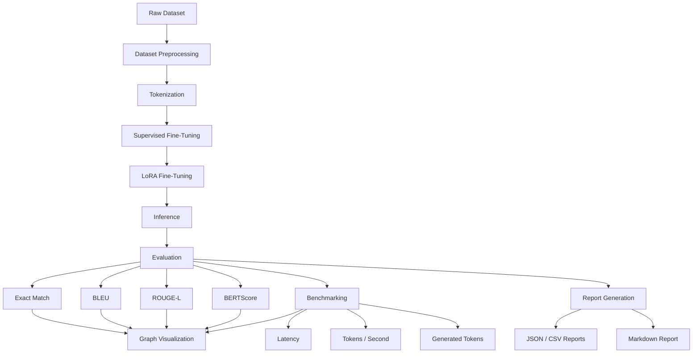
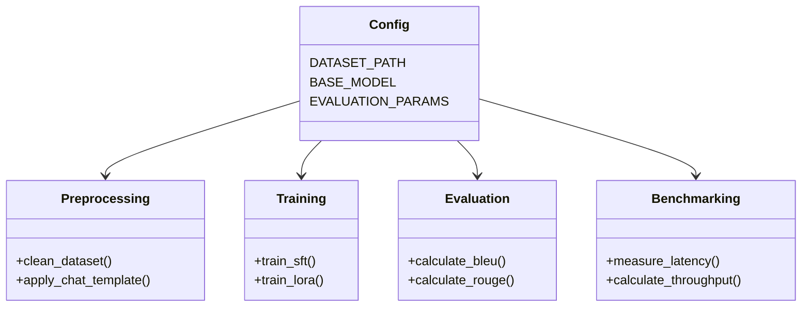

# LLM Training and Benchmarking Framework

<p align="center">


</p>

---

## Overview

This project is an end-to-end Large Language Model (LLM) Training and Benchmarking Framework built using PyTorch, Hugging Face Transformers, and PEFT (LoRA).

The framework demonstrates the complete lifecycle of an instruction-tuned language model, including dataset preprocessing, tokenization, Supervised Fine-Tuning (SFT), LoRA Fine-Tuning, inference, automatic evaluation, performance benchmarking, report generation, and graph visualization.

The project emphasizes modular design, reproducibility, and maintainability, making it suitable for experimentation, benchmarking, and future extensions.

## Architecture and Pipeline

### High-Level Architecture



### Module Structure



## Features

### Training
- Dataset preprocessing pipeline
- Instruction dataset tokenization
- Supervised Fine-Tuning (SFT)
- LoRA Fine-Tuning using PEFT
- Modular training scripts

### Inference
- Chat-based inference pipeline
- Configurable generation parameters
- CPU inference support
- Modular inference engine

### Evaluation Metrics
- Exact Match: Measures exact prediction accuracy
- BLEU: Measures n-gram similarity
- ROUGE-L: Measures longest common subsequence similarity
- BERTScore: Measures semantic similarity using contextual embeddings

### Benchmarking Metrics
- Average Latency: Average response generation time
- Average Generated Tokens: Average output token count
- Tokens / Second: Model inference throughput

### Reporting
The framework automatically generates JSON and CSV evaluation reports, Markdown benchmark reports, and visualizations for quality and performance metrics.

## Benchmark Results

The following report was generated on **2026-07-04 22:22:57** for the **Qwen/Qwen2.5-0.5B** model fine-tuned using **LoRA** on the **Trendyol Cybersecurity** dataset (10 evaluation samples).

### Hardware & Generation Settings

| Component | Specification | Setting | Value |
|-----------|---------------|---------|-------|
| CPU | AMD Ryzen 9 5950X (16 Cores / 32 Threads) | Max New Tokens | 150 |
| RAM | 64 GB DDR4 | Sampling | False |
| GPU | CPU Only | Temperature | 0.0 |
| OS | Windows 11 | | |

### Performance Metrics

| Metric | Value |
|--------|------:|
| Average Latency (seconds) | 14.1879 |
| Average Generated Tokens | 150.00 |
| Tokens / Second | 10.5724 |


### Quality Metrics

| Metric | Value |
|--------|------:|
| Exact Match | 0.0000 |
| BLEU | 0.0149 |
| ROUGE-L | 0.1433 |
| BERTScore | 0.8401 |


### Example Evaluation

**User Prompt:**
What are the specific vulnerabilities in Merkle tree implementations that could compromise blockchain integrity?

**Model Prediction:**
Merkle trees are a fundamental building block of blockchain technology, providing a decentralized consensus mechanism through the use of cryptographic hashes. However, they also introduce several vulnerabilities that can compromise blockchain integrity. One of the primary vulnerabilities is the use of the Merkle tree's internal structure, which relies on the principle of uniform hashing. This means that the same hash function is applied to all nodes in the tree, leading to a high degree of uniformity. This uniformity can be exploited by attackers who can manipulate the hash function to create a false consensus tree. Additionally, the Merkle tree's internal structure can be used to perform selective hashing, where only certain nodes are required to verify the integrity of the entire tree. This can lead to the creation of a false

**Expected Answer (From Dataset):**
Merkle tree implementations in blockchain systems face several critical vulnerabilities that can compromise cryptographic integrity and system security. These vulnerabilities align with MITRE ATT&CK techniques including T1565 (Data Manipulation) and T1078 (Valid Accounts).

**Hash Function Vulnerabilities**: The foundational risk involves cryptographically weak hash functions susceptible to collision attacks. Legacy implementations using MD5 or SHA-1 are particularly vulnerable to differential cryptanalysis, enabling adversaries to generate identical hash outputs from different inputs. This violates the collision-resistance property essential for Merkle tree integrity.

**Second Preimage Attacks**: Attackers can exploit weaknesses in hash functions to find alternative inputs producing the same hash output as legitimate data. In blockchain contexts, this enables transaction substitution or block manipulation without detection by consensus mechanisms.

**Tree Structure Manipulation**: Improper implementation of Merkle proof verification creates attack vectors. Insufficient validation of proof paths allows adversaries to submit invalid proofs that bypass integrity checks. This relates to T1078 techniques where attackers leverage legitimate authentication mechanisms maliciously.

**Memory Exhaustion Attacks**: Deep Merkle trees with excessive branching factors can trigger denial-of-service conditions through recursive hash computations, consuming system resources and potentially causing consensus failures.

**Implementation-Level Vulnerabilities**: Side-channel attacks exploit timing variations in hash computations to extract sensitive information. Additionally, integer overflow vulnerabilities in tree size calculations can lead to buffer overflows or logic errors.

NIST CSF guidelines emphasize implementing robust cryptographic controls (PR.DS-1) and continuous monitoring (DE.CM-1). Organizations should migrate to SHA-256 or SHA-3 hash functions, implement comprehensive proof verification protocols, and establish resource consumption limits. Regular security assessments following NIST SP 800-57 recommendations ensure Merkle tree implementations maintain cryptographic integrity against evolving threat landscapes.

## Project Structure

```text
LLM-Training-Benchmarking/
├── data/
│   ├── raw/
│   └── processed/
├── outputs/
│   ├── graphs/
│   ├── lora/
│   ├── metrics/
│   ├── reports/
│   └── sft/
├── scripts/
│   ├── preprocess_dataset.py
│   ├── train_sft.py
│   ├── train_lora.py
│   ├── infer_lora.py
│   └── evaluate.py
├── src/
│   ├── benchmarking/
│   ├── evaluation/
│   ├── reporting/
│   ├── visualization/
│   ├── config.py
│   ├── inference.py
│   ├── preprocessing.py
│   └── training.py
├── requirements.txt
└── README.md
```

## Installation

### Prerequisites
- Python 3.12
- Git
- Virtual Environment (recommended)

### Setup Instructions

1. Clone the Repository
```bash
git clone https://github.com/your-username/LLM-Training-Benchmarking.git
cd LLM-Training-Benchmarking
```

2. Create a Virtual Environment
```bash
python -m venv .venv
```

3. Activate the Virtual Environment
- Windows:
```bash
.venv\Scripts\activate
```
- Linux / macOS:
```bash
source .venv/bin/activate
```

4. Install Dependencies
```bash
pip install -r requirements.txt
```

## Usage

### Dataset Preprocessing
The project uses an instruction-tuning dataset consisting of system prompts, user prompts, and assistant responses.

To run preprocessing:
```bash
python -m scripts.preprocess_dataset
```
The processed dataset is saved to `data/processed/qwen_tokenized_dataset`.

### Supervised Fine-Tuning (SFT)
Train the base model using supervised fine-tuning.
```bash
python -m scripts.train_sft
```
The trained model is saved to `outputs/sft/final`.

### LoRA Fine-Tuning
Train a LoRA adapter on top of the base model.
```bash
python -m scripts.train_lora
```
The trained adapter is saved to `outputs/lora/final`.

### Evaluation and Benchmarking
Evaluate the trained models and generate benchmark reports.
```bash
python -m scripts.evaluate
```
This script will produce metrics and graphs in the `outputs/` directory.

## Design Principles

- Modular architecture
- Reusable components
- Reproducible experiments
- Automated benchmarking
- Maintainable codebase
- Extensible project structure
- Production-oriented organization

## License
MIT License