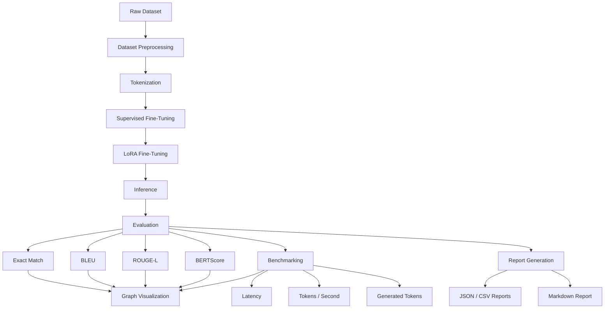
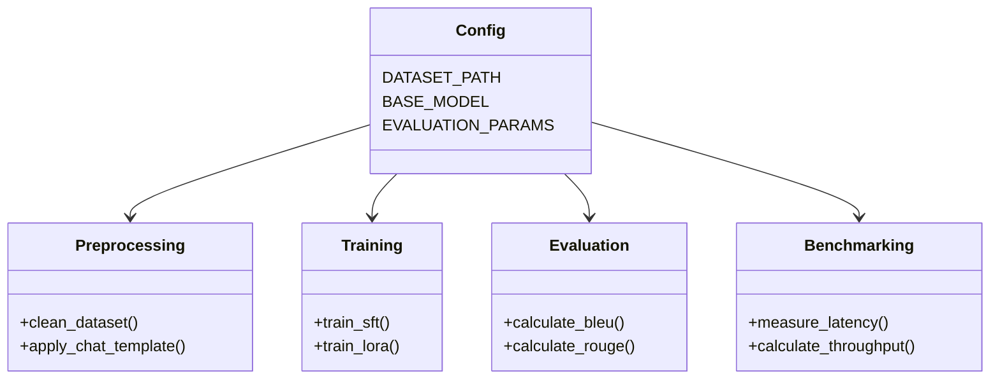

# LLM Training and Benchmarking Framework

<p align="center">


</p>

---

## Overview

This project is an end-to-end Large Language Model (LLM) Training and Benchmarking Framework built using PyTorch, Hugging Face Transformers, and PEFT (LoRA).

The framework demonstrates the complete lifecycle of an instruction-tuned language model, including dataset preprocessing, tokenization, Supervised Fine-Tuning (SFT), LoRA Fine-Tuning, inference, automatic evaluation, performance benchmarking, report generation, and graph visualization.

The project emphasizes modular design, reproducibility, and maintainability, making it suitable for experimentation, benchmarking, and future extensions.

## Architecture and Pipeline

### High-Level Architecture



### Module Structure



## Features

### Training
- Dataset preprocessing pipeline
- Instruction dataset tokenization
- Supervised Fine-Tuning (SFT)
- LoRA Fine-Tuning using PEFT
- Modular training scripts

### Inference
- Chat-based inference pipeline
- Configurable generation parameters
- CPU inference support
- Modular inference engine

### Evaluation Metrics
- Exact Match: Measures exact prediction accuracy
- BLEU: Measures n-gram similarity
- ROUGE-L: Measures longest common subsequence similarity
- BERTScore: Measures semantic similarity using contextual embeddings

### Benchmarking Metrics
- Average Latency: Average response generation time
- Average Generated Tokens: Average output token count
- Tokens / Second: Model inference throughput

### Reporting
The framework automatically generates JSON and CSV evaluation reports, Markdown benchmark reports, and visualizations for quality and performance metrics.

## Project Structure

```text
LLM-Training-Benchmarking/
├── data/
│   ├── raw/
│   └── processed/
├── outputs/
│   ├── graphs/
│   ├── lora/
│   ├── metrics/
│   ├── reports/
│   └── sft/
├── scripts/
│   ├── preprocess_dataset.py
│   ├── train_sft.py
│   ├── train_lora.py
│   ├── infer_lora.py
│   └── evaluate.py
├── src/
│   ├── benchmarking/
│   ├── evaluation/
│   ├── reporting/
│   ├── visualization/
│   ├── config.py
│   ├── inference.py
│   ├── preprocessing.py
│   └── training.py
├── requirements.txt
└── README.md
```

## Installation

### Prerequisites
- Python 3.12
- Git
- Virtual Environment (recommended)

### Setup Instructions

1. Clone the Repository
```bash
git clone https://github.com/your-username/LLM-Training-Benchmarking.git
cd LLM-Training-Benchmarking
```

2. Create a Virtual Environment
```bash
python -m venv .venv
```

3. Activate the Virtual Environment
- Windows:
```bash
.venv\Scripts\activate
```
- Linux / macOS:
```bash
source .venv/bin/activate
```

4. Install Dependencies
```bash
pip install -r requirements.txt
```

## Usage

### Dataset Preprocessing
The project uses an instruction-tuning dataset consisting of system prompts, user prompts, and assistant responses.

To run preprocessing:
```bash
python -m scripts.preprocess_dataset
```
The processed dataset is saved to `data/processed/qwen_tokenized_dataset`.

### Supervised Fine-Tuning (SFT)
Train the base model using supervised fine-tuning.
```bash
python -m scripts.train_sft
```
The trained model is saved to `outputs/sft/final`.

### LoRA Fine-Tuning
Train a LoRA adapter on top of the base model.
```bash
python -m scripts.train_lora
```
The trained adapter is saved to `outputs/lora/final`.

### Evaluation and Benchmarking
Evaluate the trained models and generate benchmark reports.
```bash
python -m scripts.evaluate
```
This script will produce metrics and graphs in the `outputs/` directory.

## Design Principles

- Modular architecture
- Reusable components
- Reproducible experiments
- Automated benchmarking
- Maintainable codebase
- Extensible project structure
- Production-oriented organization

## License
MIT License